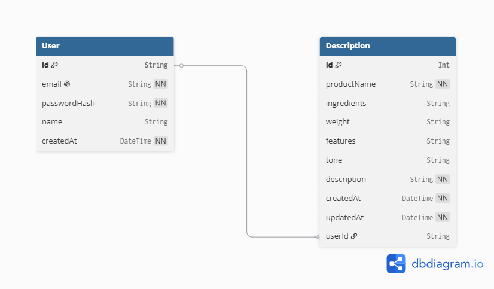

# AI Product Description Generator

A web application that generates SEO-friendly product descriptions for Himalayan food products using AI.

## Features
1. Product details input
2. AI generated descriptions
3. Tone selection
4. Regenerate and edit options
5. Copy to clipboard

## Week 2 - Frontend Skeleton
- Home page with Navbar, Hero, Card grid and Footer
- About, Dashboard and Login pages
- Responsive design with Tailwind CSS
- Built with React + Vite

## Week 4 - Backend & API Development
- REST API built with Express.js
- 6+ endpoints covering full CRUD operations
- AI-powered description generation using Hugging Face (Llama 3.1)
- Frontend connected to backend with live API calls

## Week 5 - Database Integration

- Migrated from in-memory storage to a persistent PostgreSQL database
- Database hosted on Supabase, connected via Prisma ORM
- Schema defines two models: User and Description
- All 6+ API endpoints now read from and write to the real database

### Database choice and why

We chose PostgreSQL, hosted on Supabase, using Prisma as the ORM.

- Supabase gives a fully managed Postgres instance with zero server setup, plus a dashboard to inspect data directly — useful for debugging without writing queries by hand.
- Prisma generates a type-safe client from a single schema file, so there's no raw SQL to write and fewer chances of runtime errors from typos or mismatched types.
- PostgreSQL's relational model fits the data well, since User and Description have a clear one-to-many relationship.

> Note: this project uses Prisma v6.15.0 rather than the latest v7 release, due to breaking changes in v7 that weren't compatible with this project's setup.

### Schema diagram

## How to Run Backend Locally

### Prerequisites
- Node.js installed
- Hugging Face API key
- A free Supabase account and project (for the database)

### Set up the database
1. Create a free project at supabase.com
2. Go to Project Settings → Database and copy your connection strings (pooled + direct)
3. Copy backend/.env.example to backend/.env and fill in your actual DATABASE_URL and DIRECT_URL values

### Steps
1. Clone the repository
2. Navigate to backend folder: cd backend
3. Install dependencies: npm install
4. Set up your .env file as described above, and add HF_API_KEY=your_huggingface_token_here and PORT=5000
5. Generate the Prisma client: npx prisma generate
6. Push the schema to your database: npx prisma db push
7. Start the server: npm run dev
8. Server runs on http://localhost:5000

## API Endpoints
| Method | Endpoint | Description |
|--------|----------|-------------|
| POST | /api/generate | Generate AI description |
| GET | /api/descriptions | Get all saved descriptions |
| GET | /api/descriptions/:id | Get single description |
| POST | /api/descriptions | Save a description |
| PUT | /api/descriptions/:id | Update a description |
| DELETE | /api/descriptions/:id | Delete a description |
| GET | /api/descriptions/search?q= | Search descriptions |

## How to Run Frontend Locally
1. In project root: npm install
2. npm run dev
3. Open http://localhost:5173